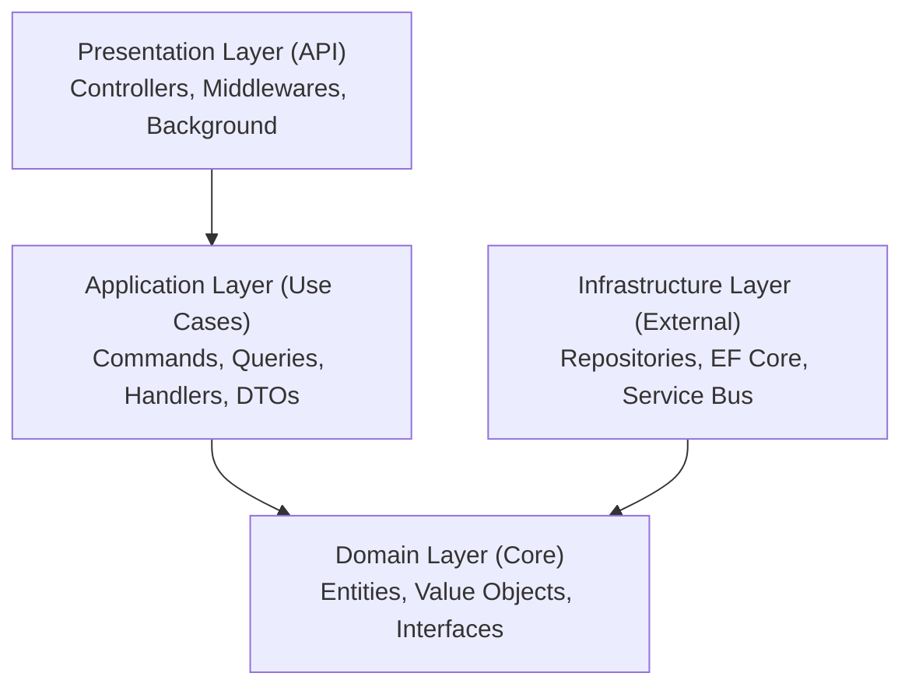

# API de consulta de créditos constituídos

Background service com APIs RESTful para consulta de créditos constituídos, desenvolvido com .NET 9.0 e Clean Architecture.

## Visão geral

Este projeto implementa um sistema de integração e consulta de créditos constituídos com as seguintes funcionalidades:

- Receber créditos via API REST e publicar no Azure Service Bus
- Processar mensagens do Service Bus em background (a cada 500ms)
- Inserir créditos no PostgreSQL de forma individual
- Consultar créditos por número da NFS-e ou número do crédito
- Health checks para monitoramento (/health/self, /health/ready)

## Tecnologias utilizadas

- **.NET 9.0** - Framework principal
- **C#** - Linguagem de programação
- **Entity Framework Core** - ORM para acesso a dados
- **PostgreSQL** - Banco de dados relacional
- **Azure Service Bus** - Mensageria
- **Docker** - Containerização
- **xUnit** - Testes unitários
- **FluentValidation** - Validações
- **AutoMapper** - Mapeamento de objetos
- **Serilog** - Logging estruturado
- **Polly** - Resiliência e Circuit Breaker

## Resiliência e tolerância a falhas

O projeto implementa múltiplas estratégias de resiliência para garantir alta disponibilidade:

### Circuit Breaker com Polly

O `ServiceBusConsumer` utiliza o padrão Circuit Breaker para proteger a aplicação de falhas em cascata:

```csharp
// ServiceBusConsumer.cs
_circuitBreaker = Policy
    .Handle<ServiceBusException>()
    .Or<SocketException>()
    .CircuitBreakerAsync(
        exceptionsAllowedBeforeBreaking: 3,
        durationOfBreak: TimeSpan.FromSeconds(30),
        onBreak: (ex, breakDelay) => { /* Log warning */ },
        onReset: () => { /* Log info */ }
    );
```

**Configuração:**
- **3 falhas consecutivas**: Abre o circuito
- **30 segundos**: Tempo de espera antes de tentar reconectar
- **Logs estruturados**: Registra eventos de abertura e fechamento do circuito

**Localização**: `src/ConsultaCreditos.Infrastructure/Messaging/ServiceBusConsumer.cs:22,28,73`

### Habilitação condicional do Service Bus

O background service pode ser habilitado/desabilitado via configuração:

```csharp
// Program.cs
if (builder.Configuration.GetValue<bool>("ServiceBus:Enabled"))
{
    builder.Services.AddHostedService<CreditoProcessorService>();
}
```

**Configuração em appsettings.json:**

```json
{
  "ServiceBus": {
    "Enabled": true,  // false para desabilitar em desenvolvimento
    "ConnectionString": "...",
    "TopicName": "integrar-credito-constituido-entry",
    "SubscriptionName": "credito-processor",
    "CheckInterval": 500
  }
}
```

**Uso:**
- **Production**: `"Enabled": true` - Service Bus ativo
- **Development**: `"Enabled": false` - Service Bus desabilitado (útil para testes locais)
- **Staging**: `"Enabled": true` - Service Bus ativo com configurações de staging

### Health checks

A API expõe endpoints de health check para monitoramento:

**GET /health/self**
- Verifica se a API está respondendo
- Não depende de serviços externos
- Ideal para load balancers

**GET /health/ready**
- Verifica PostgreSQL (conexão e disponibilidade)
- Verifica Azure Service Bus (conexão e tópico)
- Retorna 200 OK apenas se todos os serviços estão prontos

**Configuração:**

```csharp
builder.Services.AddHealthChecks()
    .AddNpgSql(connectionString, name: "postgresql", tags: ["ready"])
    .AddAzureServiceBusTopic(connectionString, topicName, name: "servicebus", tags: ["ready"]);
```

### Tratamento de erros no processamento de mensagens

O `ServiceBusConsumer` implementa tratamento robusto de erros:

- **Dead Letter Queue**: Mensagens inválidas são enviadas para a DLQ
- **Abandon Message**: Mensagens com erro de processamento são abandonadas para retry
- **Complete Message**: Mensagens processadas com sucesso são marcadas como completas
- **MaxConcurrentCalls**: 1 (processamento sequencial para evitar sobrecarga)
- **AutoCompleteMessages**: false (controle manual de confirmação)

### Benefícios da arquitetura de resiliência

1. **Proteção contra falhas em cascata**: Circuit Breaker evita sobrecarga
2. **Flexibilidade em ambientes**: Ativa/desativa Service Bus conforme necessário
3. **Monitoramento proativo**: Health checks permitem alertas antes de falhas
4. **Recuperação automática**: Retry automático de mensagens com falha
5. **Observabilidade**: Logs estruturados com Serilog facilitam troubleshooting

## Arquitetura

O projeto segue os princípios de Clean Architecture com separação em camadas:



### Estrutura de pastas

```
src/
├── ConsultaCreditos.API/              # Camada de apresentação
├── ConsultaCreditos.Application/      # Camada de aplicação
├── ConsultaCreditos.Domain/           # Camada de domínio
├── ConsultaCreditos.Infrastructure/   # Camada de infraestrutura
└── ConsultaCreditos.Shared/           # Código compartilhado

tests/
└── ConsultaCreditos.UnitTests/        # Testes unitários
```

## Pré-requisitos

### Para executar com Docker (recomendado)

- [Docker Desktop](https://www.docker.com/products/docker-desktop)
- Azure Service Bus (namespace, tópico e subscription configurados)

### Para executar localmente

- [.NET 9.0 SDK](https://dotnet.microsoft.com/download/dotnet/9.0)
- [PostgreSQL 16+](https://www.postgresql.org/download/)
- Azure Service Bus (namespace, tópico e subscription configurados)

## Configuração

### 1. Azure Service Bus

Configure o Azure Service Bus:

1. Crie um namespace no Azure Portal
2. Crie um tópico: `integrar-credito-constituido-entry`
3. Crie uma subscription para o tópico
4. Copie a connection string

### 2. Variáveis de ambiente

Crie um arquivo `.env` na raiz do projeto:

```bash
cp .env.example .env
```

Configure as variáveis:

```env
SERVICEBUS_CONNECTION_STRING=Endpoint=sb://your-namespace.servicebus.windows.net/;SharedAccessKeyName=RootManageSharedAccessKey;SharedAccessKey=your-key
```

## Executando o projeto

### Opção 1: Docker (recomendado)

#### Windows (PowerShell)

```powershell
# Iniciar todos os serviços
.\scripts\start.ps1

# Aplicar migrations no banco
.\scripts\migrations.ps1

# Parar serviços
.\scripts\stop.ps1
```

#### Linux/Mac

```bash
# Tornar scripts executáveis (primeira vez)
chmod +x scripts/*.sh

# Iniciar todos os serviços
./scripts/start.sh

# Aplicar migrations no banco
./scripts/migrations.sh

# Parar serviços
./scripts/stop.sh
```

A API estará disponível em: http://localhost:8080

### Opção 2: Execução local

1. Configure a connection string do PostgreSQL no `appsettings.Development.json`
2. Execute as migrations:

```bash
cd src/ConsultaCreditos.API
dotnet ef database update --project ../ConsultaCreditos.Infrastructure
```

3. Execute a aplicação:

```bash
dotnet run --project src/ConsultaCreditos.API
```

A API estará disponível em: http://localhost:5000

## Endpoints da API

### Health checks

```bash
GET /health/self   # Verifica se a API está respondendo
GET /health/ready  # Verifica se API, PostgreSQL e Service Bus estão prontos
```

### Integrar créditos

```bash
POST /api/creditos/integrar-credito-constituido
```

**Request body:**

```json
[
  {
    "numeroCredito": "123456",
    "numeroNfse": "7891011",
    "dataConstituicao": "2024-02-25",
    "valorIssqn": 1500.75,
    "tipoCredito": "ISSQN",
    "simplesNacional": "Sim",
    "aliquota": 5.0,
    "valorFaturado": 30000.0,
    "valorDeducao": 5000.0,
    "baseCalculo": 25000.0
  }
]
```

**Response (202 Accepted):**

```json
{
  "success": true
}
```

### Consultar créditos por NFS-e

```bash
GET /api/creditos/{numeroNfse}
```

**Response:**

```json
[
  {
    "numeroCredito": "123456",
    "numeroNfse": "7891011",
    "dataConstituicao": "2024-02-25",
    "valorIssqn": 1500.75,
    "tipoCredito": "ISSQN",
    "simplesNacional": "Sim",
    "aliquota": 5.0,
    "valorFaturado": 30000.00,
    "valorDeducao": 5000.00,
    "baseCalculo": 25000.00
  }
]
```

### Consultar crédito específico

```bash
GET /api/creditos/credito/{numeroCredito}
```

**Response:**

```json
{
  "numeroCredito": "123456",
  "numeroNfse": "7891011",
  "dataConstituicao": "2024-02-25",
  "valorIssqn": 1500.75,
  "tipoCredito": "ISSQN",
  "simplesNacional": "Sim",
  "aliquota": 5.0,
  "valorFaturado": 30000.00,
  "valorDeducao": 5000.00,
  "baseCalculo": 25000.00
}
```

## Executando testes

```bash
# Executar todos os testes
dotnet test

# Executar com cobertura
dotnet test /p:CollectCoverage=true
```

## Documentação da API

A documentação completa da API é gerada automaticamente via **Swagger/OpenAPI** a partir do código-fonte.

**Acesse a documentação interativa:**
```
http://localhost:8080/swagger
```

**Recursos do Swagger:**
- Documentação completa de todos os endpoints
- Testar endpoints diretamente no navegador (Try it out)
- Schemas detalhados de request/response
- Exemplos práticos de uso
- Códigos de status HTTP e validações

**OpenAPI Spec (JSON):**
```
http://localhost:8080/openapi/v1.json
```

## Documentação adicional

- [Guia de Docker](DOCKER.md) - Informações detalhadas sobre containerização
- [Setup do Azure Service Bus](AZURE-SERVICE-BUS-SETUP.md) - Guia completo de configuração
- [Estratégia de Testes](TESTING-STRATEGY.md) - Cobertura e abordagem de testes

## Fluxo de funcionamento

1. Cliente envia lista de créditos via POST `/api/creditos/integrar-credito-constituido`
2. API valida os dados e publica cada crédito como mensagem individual no Azure Service Bus
3. Background service consome mensagens do Service Bus a cada 500ms
4. Cada mensagem é processada e o crédito é inserido no PostgreSQL (sem bulk insert)
5. Cliente pode consultar créditos salvos via GET endpoints

## Padrões de projeto aplicados

- **Repository Pattern** - Abstração de acesso a dados
- **CQRS (simplificado)** - Separação de Commands e Queries
- **Factory Pattern** - Criação de entidades
- **Dependency Injection** - Inversão de controle
- **Unit of Work** - Via EF Core DbContext

## Princípios SOLID aplicados

- **S**ingle Responsibility - Cada classe tem uma responsabilidade
- **O**pen/Closed - Aberto para extensão, fechado para modificação
- **L**iskov Substitution - Abstrações respeitadas
- **I**nterface Segregation - Interfaces específicas
- **D**ependency Inversion - Dependências apontam para abstrações

## Estrutura do banco de dados

```sql
CREATE TABLE credito (
    id                 BIGINT GENERATED BY DEFAULT AS IDENTITY,
    numero_credito     VARCHAR(50)    NOT NULL,
    numero_nfse        VARCHAR(50)    NOT NULL,
    data_constituicao  DATE           NOT NULL,
    valor_issqn        DECIMAL(15, 2) NOT NULL,
    tipo_credito       VARCHAR(50)    NOT NULL,
    simples_nacional   BOOLEAN        NOT NULL,
    aliquota           DECIMAL(5, 2)  NOT NULL,
    valor_faturado     DECIMAL(15, 2) NOT NULL,
    valor_deducao      DECIMAL(15, 2) NOT NULL,
    base_calculo       DECIMAL(15, 2) NOT NULL
);
```

## Troubleshooting

### Docker Desktop não está rodando

```
ERROR: error during connect...
```

Inicie o Docker Desktop antes de executar os scripts.

### Erro ao conectar no Service Bus

Verifique:
- Connection string no arquivo `.env`
- Tópico e subscription criados no Azure
- Permissões de acesso configuradas

### Porta já em uso

Altere a porta no `docker-compose.yml` ou pare o serviço que está usando a porta 8080.

### Migrations não aplicadas

Execute:

```bash
# Com Docker
./scripts/migrations.sh  # ou .ps1 no Windows

# Local
dotnet ef database update --project src/ConsultaCreditos.Infrastructure --startup-project src/ConsultaCreditos.API
```

## Contribuindo

1. Clone o repositório
2. Crie uma branch para sua feature (`git checkout -b feature/nova-funcionalidade`)
3. Commit suas mudanças (`git commit -m 'Adiciona nova funcionalidade'`)
4. Push para a branch (`git push origin feature/nova-funcionalidade`)
5. Abra um Pull Request

## Licença

Este projeto está sob a licença MIT. Veja o arquivo [LICENSE](LICENSE) para mais detalhes.
